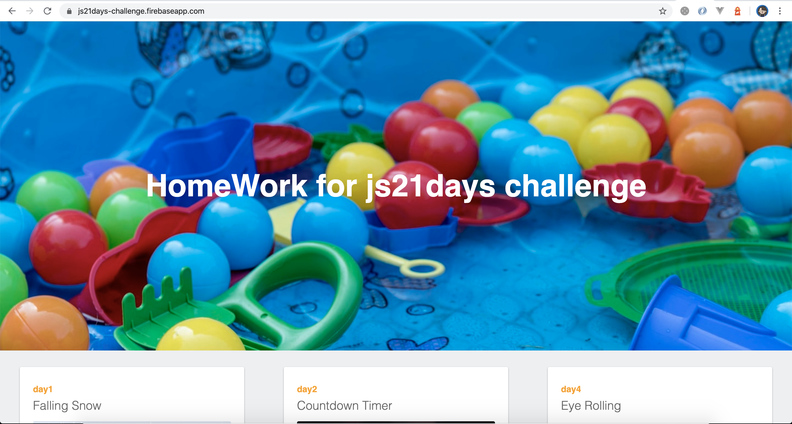

# js21days

HomeWork for js21days challenge

### Tutorial Blog & demo
* [week 1 : day 1 - 7](https://www.mikkipastel.com/js21days-challenge-week1/) 
[01 - Falling Snow](https://js21days-challenge.firebaseapp.com/01-falling-snow/index.html) 
[02 - Countdown Timer](https://js21days-challenge.firebaseapp.com/02-countdown-timer/index.html) 
03 - Async Await 
[04 - Eye Rolling](https://js21days-challenge.firebaseapp.com/04-eye-rolling/index.html) 
[05 - Watercolor Painting](https://js21days-challenge.firebaseapp.com/05-watercolor-painting/index.html) 
[06 - Duck Hunt](https://js21days-challenge.firebaseapp.com/06-duck-hunt/index.html) 
[07 - Konami Code](https://js21days-challenge.firebaseapp.com/07-konami-code/index.html) 
* [week 2 : day 8 - 14](https://www.mikkipastel.com/js21days-challenge-week2/) 
08 - What is "this"? 
[09 - Parallax Scrolling](https://js21days-challenge.firebaseapp.com/09-parallax-scrolling/index.html) 
[10 - Kanban Board](https://js21days-challenge.firebaseapp.com/10-kanban-board/index.html) 
[11 - Text Reveal](https://js21days-challenge.firebaseapp.com/11-text-reveal/index.html) 
[12 - Air Quality Visualizer ](https://js21days-challenge.firebaseapp.com/12-air-quality-visualizer/index.html) 
13 - JavaScript Weird Parts 
[14 - Carousel](https://js21days-challenge.firebaseapp.com/14-carousel/index.html) 
* [week 3 : day 15 - 21](https://www.mikkipastel.com/js21days-challenge-week3/) 
[15 - Music Player](https://js21days-challenge.firebaseapp.com/15-music-player/index.html) 
[16 - Text to Speech](https://js21days-challenge.firebaseapp.com/16-text-to-speech/index.html) 
[17 - Speech to Text](https://js21days-challenge.firebaseapp.com/17-speech-to-text/index.html) 
18 - What is "prototype"? 
19 - Autocomplete 
20 - Form Validation 
21 - Infinite Scroll Gallery 